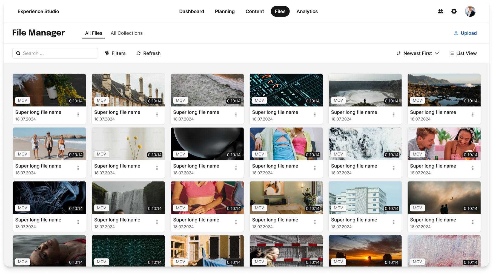
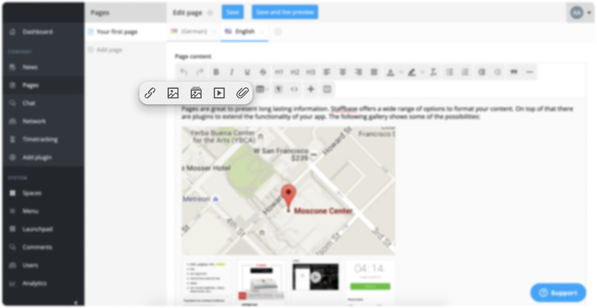
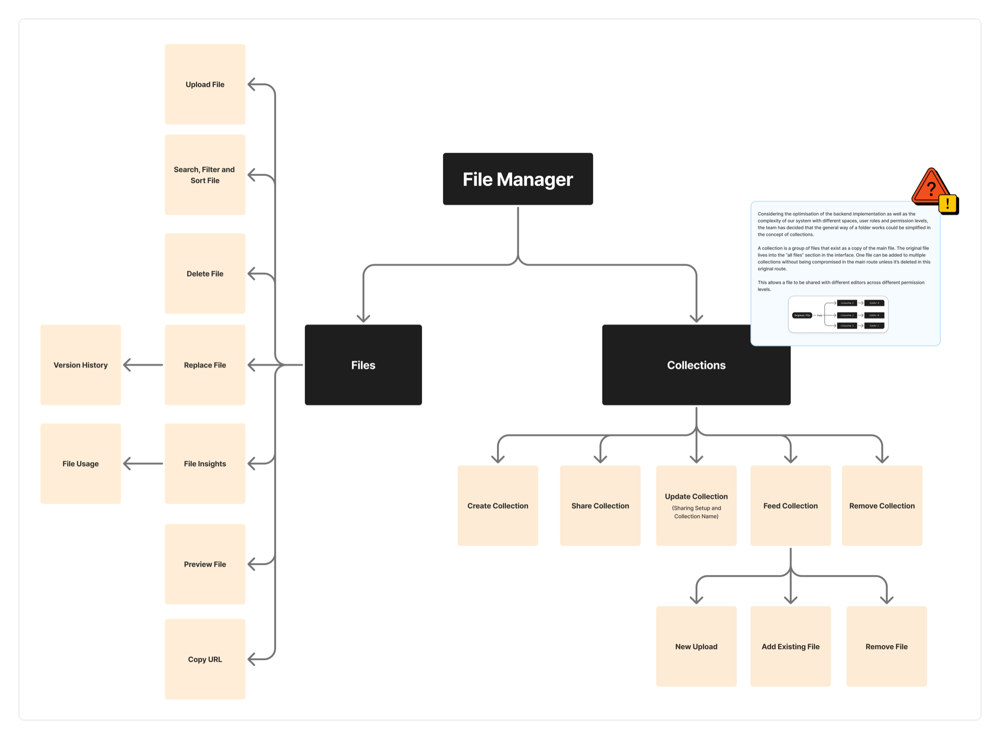
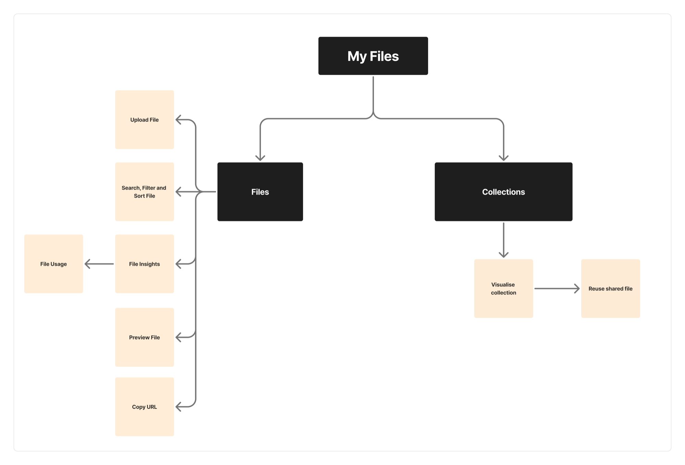

# Media Management Ecosystem for a B2B SaaS Platform

*Case study*

**Role:** Product Designer Lead: from discovery to implementation
**Timeline:** ~4 years
**Team:** Me (Product Designer), Product Manager, Researchers, Frontend & Backend engineers, Copywriting, as well as cross-product collaborations
**Platform:** An employee-communication SaaS

---

## Overview

Over roughly four years I led the development of a connected media-management ecosystem for Staffbase. I owned this work end-to-end, from discovery through UX/UI, hand-off, implementation, and iteration.

That long design process produced a system of two complementary features: My Files (for content editors) and File Manager (for admins), turning scattered, one-off uploads into a central, permission-aware system for uploading, reusing, managing, organizing, sharing, replacing, and analyzing files.

Today the File Manager sits at roughly **95% adoption** with about **1,500 active business accounts**.

---

## Problem

Experience Studio is where companies build the content their employees read: news, pages, emails, campaigns. A big part of that content is media: images, documents, video. And media was exactly where the Studio fell short.

The team came to me with a narrow request: *let users delete their files.* But as I dug into why deletion was even a problem, a bigger pattern surfaced. Deletion was just one missing piece of a tool that had no real system for managing media at all. That reframed the work. The question stopped being “how do we add a delete button” and became “How do we enable our users to manage and reuse media files inside our platform?”

The product has two sides:

- **The Studio**, where admins and editors create content.
- **The App**, where employees consume it.

My scope was the Studio, and the two roles who live there:

- **Amara, the Admin**: keeps the whole company on the *correct*, approved, up-to-date assets.
- **Leo, the Editor**: just wants to *reuse* the right files and publish without friction.

When I picked up this work, managing media in the Studio meant:

- **A confusing upload flow.** An overloaded toolbar with three separate upload buttons, plus drag-and-drop and media widgets. Too many ways to do one thing.
- **No reuse.** Every use of a file meant a fresh upload, even for the same asset.
- **No feedback.** No upload progress, no clear errors.
- **No way to delete or replace.** Outdated documents lived on across published pages with no clean way to update them.
- **No sharing or collaboration.** Admins couldn’t hand editors a curated set of approved assets, so teams fell back on Google Drive and Canva, pulling work outside the Studio entirely.

*The starting point of media handling in the content creation flow.*

In short: the Studio had no central, trustworthy home for company media. That was a daily usability pain *and* a business problem: every file managed in an external tool was value leaving the product.

---

## Approach

This was not a tidy, linear process, and I think that’s the honest, valuable part of the story. It was also a unique opportunity to push and grow as a designer.

### Discovery

We ran early workshops with multiple stakeholders to understand how media was actually handled, both by our customers and internally, across our infrastructure and code architecture (user roles, spaces, and branches).

Through many product calls with customers and users, a recurring insight emerged: on almost every team, media management was happening outside of our platform. That became a valuable signal, pointing us to missing opportunities in our product.

This pushed me to dig deeper into what the missing pieces were and how they were blocking user flows, working closely with our PM and customer care teams. Along the way, I learned how the editor and administrator roles worked and overlapped across content planning, creation, and management. That understanding led to the framing of two distinct, role-based interfaces: **My Files**, focused on content creators, and **File Manager**, focused on admin roles.

> “I use the same document in a lot of places. Our handbook lives on the HR page, the onboarding page, and a few others. But it changes often, and every time it does I have to update every copy by hand. I just want to upload the new version once and have it reflected everywhere.”
>
> **Enterprise Customer X**

These insights fed a set of “How Might We” questions that kept reframing the problem as it grew:

- How might we allow content creators to upload and reuse their own files?
- How might we create a central place where admins can create, share, and manage files with editors?
- How might we simplify media usage inside the Studio?
- How might we enable admins to update document files already used in pages and news?
- How might we measure adoption of these features?

### A feature-architecture map

**Embracing the non-linear.** The project literally started as a narrow “How might we let users delete files?” Then it grew: once we realized that deletion touches roles, permissions, and published content, it expanded into the much larger File Manager vision.

Because the ecosystem became genuinely complex, I built a feature-architecture scheme: a diagram that translated users’ jobs-to-be-done into a connected set of features, showing where My Files and File Manager overlap, connect, or stay separate. It kept the team aligned on *what belonged where*, and it strengthened the communication and negotiation between Product Design and Product Management.

*File Manager feature-architecture map: the admin-facing feature set across Files and Collections.*

*My Files feature-architecture map: the lighter, editor-facing subset for content creators.*

---

## Solution

The core structural decision was to split the experience by role, then connect the two halves:

- **My Files (editor-facing)** lives inside the content-creation flow. Editors upload new files, reuse their own previous uploads from many entry points (media plugins, email, widgets), and access collections that admins have shared with them. The guiding principle: *in the editor’s world, the goal is to create content, not to manage files.*
- **File Manager (admin-facing)**: a dedicated, global interface for admins to upload, search, filter, organize, share, delete, replace, and analyze files across the whole platform. The guiding principle: *give admins real control and oversight, in a space designed for management, not content creation.*

Under the hood I designed shared functions the two features could reuse, so the ecosystem stayed consistent even as each side evolved at its own pace.

### ★ Deep dive: File Manager

The File Manager is the heart of this case study: the admin’s command center for company media. It grew feature by feature, each with its own design story.

### Collections & sharing: the headline problem

Admins needed to group approved files and share them with specific editors or user groups. Key decisions:

- We renamed **“folders” → “collections.”** A folder implies *moving* a file; in our system a file is *copied* to exist inside a collection while the original stays put. New name, less confusion.
- For the MVP we deliberately **dropped sub-collections**: a flatter structure meant no breadcrumbs and a simpler back-button navigation.
- Sharing was built on **user groups**, reusing logic the Studio already had, with roles per collection (view-only vs. manage).

<!-- IMAGE: Collections: create & share flow, or the collection grid -->

### File deletion: where it all started

The project’s original seed. We had to reason carefully about impact: a deleted file might live in My Files, in the content editor, *and* in already-published content. We ended up defining multiple deletion paths (including a “forced deletion” for admins to remove compromised or wrong files across every space) and, importantly, rethought *who* should be allowed to delete, given the downstream impact on published content.

<!-- IMAGE: Deletion flow / confirmation modal -->

### Replacement + version history + file usage

A frequently requested capability: let admins swap an outdated document for a new version *without* manually hunting down and re-uploading it everywhere. This raised deep questions: when exactly does the replacement happen? Does it propagate to every usage? Where does version history live? After back-and-forth with engineering, we chose a fullscreen approach over stacking a modal-on-a-modal, which reduced accessibility problems and gave users the context they needed to replace confidently.

<!-- IMAGE: Replace flow: fullscreen vs. the earlier modal-on-modal -->

### File Insights: measuring media

Contextual analytics per file type, starting with **video** metrics (Total Play, Unique Play, Watch Time), tracked via Pendo. We ran usability tests on how to surface a metric’s explanation without interrupting the flow, landing on a support “?” trigger rather than fragile hover interactions. Scope was intentionally trimmed over time as priorities shifted, an honest reflection of real product trade-offs.

<!-- IMAGE: File Insights: video metrics card with the “?” support trigger -->

### Key decisions & trade-offs

- **Folders → Collections**: language shapes mental models; we chose the word that matched how the system actually behaves.
- **Condensed upload icon**: we collapsed the cluttered toolbar into a single condensed upload. The first icon (a paperclip) confused users, who couldn’t tell attachments from media uploads; we switched to an image icon and adoption of the new toolbar settled.
- **Fullscreen over modal-on-modal**: chosen for accessibility and context, and it gave us a flexible, expandable pattern for future features.
- **Scoping and feature priority**: repeatedly cutting scope (no sub-collections, video-only insights first, replacement before version history, no version history for deletion) to ship real value in small, backend-feasible batches.

---

## Outcomes

The ecosystem shipped in batches and became the central place for handling company media in the Studio: uploading, reusing, organizing, sharing, replacing, and analyzing files, all in one permission-aware system. The File Manager is now used across the platform, and the team is scoping its move fully out of Beta.

I also want to be honest about the limits. As a design team we don’t have complete, refined access to customer usage data, and I’m still growing my own ability to turn analytics into product insight, reading what the numbers and charts actually *mean*, not just what they show. There’s an internal effort forming a dedicated team for feature-usage analytics, and better tracking (more Pendo paths: how often a collection is shared, edited, deleted) is a clear next step. I’d rather show that growth edge than pretend the measurement was perfect.

<!-- IMAGE: Final polished File Manager UI: the shipped experience -->

---

## Success Metrics

<!-- IMAGE: Adoption metric: dashboard / feature-flag comparison -->

- **~95% adoption** of the File Manager, with about **1,500 active business accounts**, putting it among the platform’s most-adopted features when benchmarked against one of the most-used feature flags.

---

## Challenges

The Studio is built on layered roles and permission levels, defined by user groups and tied to structural units called **spaces**. Almost every media decision collided with this system:

- Which files should be saved? From which plugins?
- Where should they be saved?
- Are the content creators (including external creators) allowed to see all files?
- Who is allowed to *delete* a file, and from where? An editor? An admin? What happens to content that already uses it?
- How do you let an admin *share* a curated collection of files without that sharing being blocked or fragmented by space permissions?
- If a file is *replaced*, does it change everywhere it’s used, in content, in collections, in someone’s personal files?

The single biggest breakthrough was realizing that **collections should not be tied to spaces at all.** The content section was filtered by space definitions, which meant a space-bound approach to sharing would quietly fail for real customers. Decoupling media from the space hierarchy, and eventually moving the File Manager to a *global* place in the Studio, is what finally made sharing and collections possible.

> The visible design work (clean modals, clear icons) sat on top of a much harder, invisible design problem: modeling *who can do what, to which file, in which context.* That’s the thread I’m proudest of.

### Where it broke: failures & iterations

The parts I learned the most from didn’t work the first time.

- **The paperclip that confused everyone.** The first condensed-upload icon (a paperclip) made users think “attachment,” not “media upload.” We switched to an image icon and the confusion disappeared.
- **Version history vs. changelog.** Backend started building version history as a *changelog* (every edit), while the design intent was to preserve the file’s original registration. It took several cross-team discussions to realign on the same concept.
- **Putting File Manager in the wrong place.** In the first implementation the information architecture wasn’t clear, and the global File Manager landed under “content”, even though that clashed with how spaces work. We flagged it, then later moved it to a properly global location.
- **Hover-heavy interactions hurt accessibility.** Early designs leaned on hover and tooltips; testing and review pushed us to reduce hover and add a persistent support “?” trigger instead.
- **Losing the source of truth.** With so many iterations, developers sometimes built from outdated Figma files. I fixed the *process*, not just a screen, consolidating everything into a single Figma Library (documented components, used icons, known issues) so there was one reliable source.

<!-- IMAGE: Before → after of one failure: e.g. paperclip vs. image icon, or the File Manager relocation -->

---

## Reflection

This was the most complex system I’ve designed: four years, two roles, one tangled permission model, and a genuinely non-linear path from “let users delete a file” to “a central media-management ecosystem.”

> The real design problem was rarely the screen in front of me: it was the invisible model of roles, permissions, and context underneath it. Getting that model right is what let the visible design finally feel simple.
